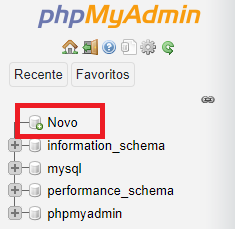
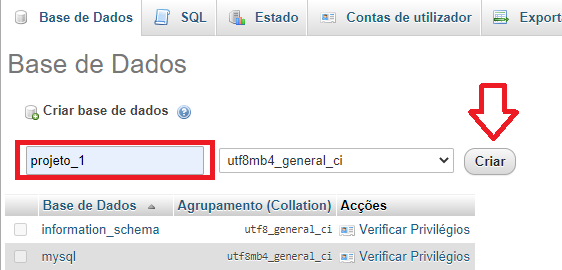
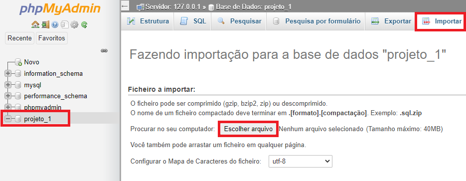

<h1 align="center">
  CMS Project
</h1>

## O que é?
Este projeto é exemplo básico de uma aplicação CMS (Content Management System), escrito em PHP :elephant:.

## Como posso testá-lo?:

```
- Instale um servidor Apache na sua máquina ✔

- Clone este projeto na pasta raiz do servidor (pasta htdocs) ✔

- Inicie o servidor e acesse o phpMyAdmin: http://localhost/phpmyadmin ✔

- Crie seu banco de dados clicando em "Novo" e depois digite "projeto_1" no campo de criar base de dados. 
  Siga as imagens a seguir: ✔

```

<h1 align="center">
    
</h1>

<h1 align="center">
    
</h1>

```
- Em seguida, selecione a opção importar, escolha o arquivo projeto_1.sql que está na pasta raiz
  e clique em executar ✔

```

<h1 align="center">
    
</h1>

```
- Agora, acesse op link: http://localhost/cms-project/ e veja meu trabalho :) ✔

```

---
Feito por Luiz Felipe Gondim.
